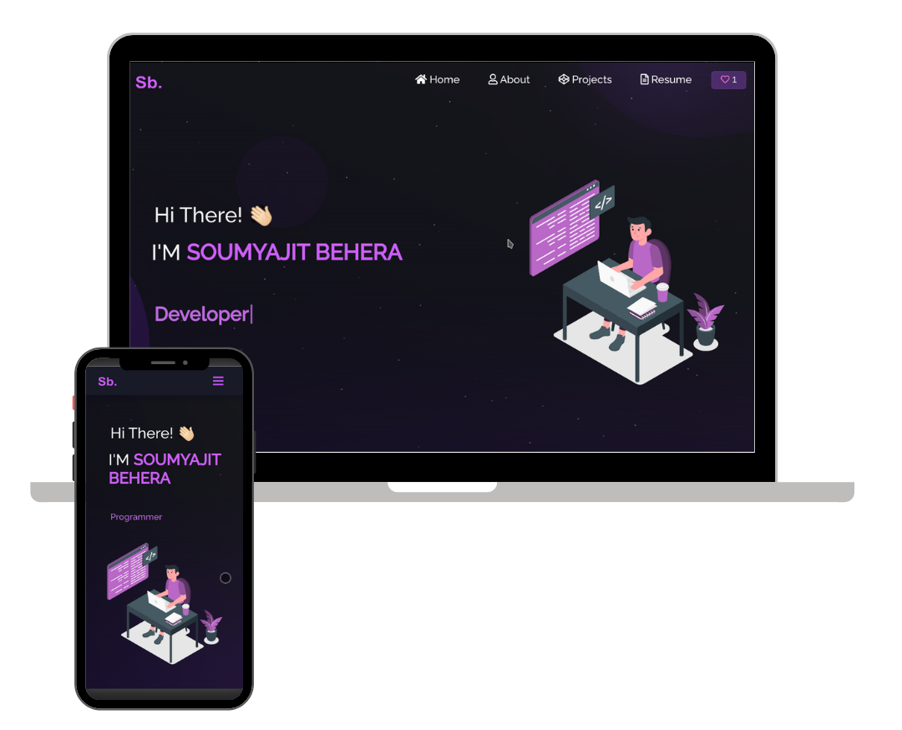

<h2 align="center">
  Portfolio Website - Vinith Kumar
  <br/>
  <a href="https://your-portfolio-link.vercel.app/" target="_blank">vinithkumar.dev</a>
</h2>

<div align="center">
  
</div>

<br/>

<center>

[](https://forthebadge.com)  
[](https://forthebadge.com)  
[](https://forthebadge.com)  

</center>

<h3 align="center">
    🔹
    <a href="https://github.com/VinithKumar2107">GitHub Profile</a>
    🔹
</h3>

## 🚀 About Me

Hi, I'm **Vinith Kumar**, a passionate **MERN Stack Developer** and aspiring Software Engineer.

I enjoy building modern web applications and solving real-world problems through technology. My expertise includes full-stack development using **MongoDB, Express.js, React.js, and Node.js**, along with strong fundamentals in **JavaScript** and **Java**.

## 🛠 Tech Stack

### Frontend

* React.js
* HTML5
* CSS3
* Bootstrap

### Backend

* Node.js
* Express.js

### Database

* MongoDB
* Mongoose

### Programming Languages

* JavaScript
* Java

### Tools & Technologies

* Git
* GitHub
* Postman
* VS Code
* REST APIs
* Socket.IO

---

## 📂 Featured Projects

### 📋 Task Management Application

A full-stack MERN application for creating, organizing, updating, and tracking tasks efficiently.

**Features:**

* Task Creation & Management
* Status Tracking
* Responsive UI
* RESTful APIs
* MongoDB Integration

### 💬 WhatsApp-like Real-Time Chat Application

A real-time chat application built using the MERN stack and Socket.IO.

**Features:**

* Real-Time Messaging
* User Authentication
* Responsive Chat Interface
* Instant Message Delivery
* Scalable Backend Architecture

### 🛒 E-Commerce Platform

A complete MERN stack e-commerce solution for product management and online shopping workflows.

**Features:**

* Product Browsing
* Shopping Cart Functionality
* REST APIs
* Responsive Design
* Full-Stack Architecture

---

## ✨ Features

* 📖 Multi-Page Layout
* 🎨 Modern UI Design
* 📱 Fully Responsive
* ⚡ Fast Performance
* 🌐 MERN Stack Powered

---

## 🛠 Installation and Setup

Clone the repository:

```bash
git clone https://github.com/VinithKumar2107/portfolio.git
```

Install dependencies:

```bash
npm install
```

Run the application:

```bash
npm start
```

Open:

```text
http://localhost:3000
```

---

## 📬 Connect With Me

* GitHub: https://github.com/VinithKumar2107
* LinkedIn: https://www.linkedin.com/in/vinithkumar-ruckmangathan

---

## ⭐ Show Your Support

If you like this project, please give it a ⭐ on GitHub.

Building projects, learning continuously, and turning ideas into reality 🚀
# Portfolio
